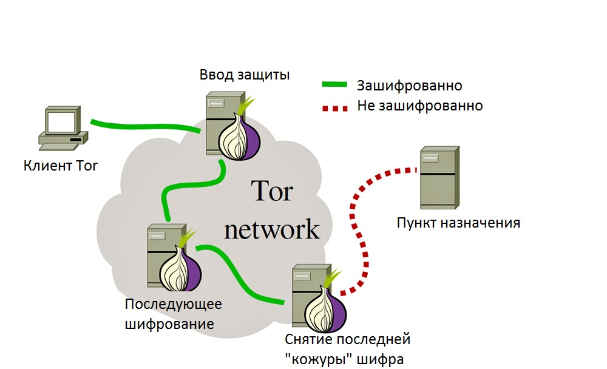

# 🧅 Гайд: Что такое Tor и зачем он нужен

Этот проект — подробный разбор того, как работает анонимная сеть Tor, кто её создал и почему это важнейший инструмент для приватности в интернете.

---

## 1. Что такое Tor и как он появился?

### О Tor
**Tor (The Onion Router)** — это свободное и открытое ПО для реализации луковой маршрутизации. Это система прокси-серверов, позволяющая устанавливать анонимное сетевое соединение, защищенное от прослушивания.

* **Как это работает:** Tor создает сеть виртуальных туннелей, передавая данные в зашифрованном виде.
* **Для чего:** Анонимность при посещении сайтов, ведении блогов, отправке сообщений и работе с любыми приложениями, использующими протокол TCP.

### История появления
Технология «луковой маршрутизации» была разработана в 1990-х в **Исследовательской лаборатории ВМС США**. Цель была прозаичной — создать защищенный канал связи для разведки, чтобы перехват трафика не позволял вычислить отправителя и получателя.

### Почему это Open Source?
В 2000-х проект был передан сообществу (The Tor Project) по двум причинам:

1.  **Безопасность через массовость:** Система анонимности работает только тогда, когда в ней много обычных людей. Трафик спецслужб «растворяется» в потоке данных пользователей, становясь невидимым.
2.  **Прозрачность кода:** Только открытый код позволяет тысячам экспертов искать и закрывать «дыры» в безопасности. Открытость — это гарантия отсутствия «черных ходов» (бэкдоров) для слежки.

---

## 2. Как это устроено?

Название **«луковая маршрутизация»** идеально описывает принцип работы: данные «оборачиваются» в несколько слоев шифрования, как луковица.

* **Входной узел (Guard):** Знает, КТО вы, но не знает, КУДА вы идете.
* **Промежуточный узел (Middle):** Не знает ни кто вы, ни куда вы идете. Он знает только адрес предыдущего и следующего узла.
* **Выходной узел (Exit):** Снимает последний слой шифрования и отправляет данные на нужный сайт. Он знает, КУДА вы идете, но не знает, КТО вы.

> **Важно:** Благодаря тому, что каждый узел знает только «соседа», никто во всей цепочке не имеет полной информации о связи «пользователь — сайт».

---

## 3. Кто и зачем использует Tor?

Tor — это инструмент для всех, кому важна приватность. Основные группы пользователей:

* **Обычные люди:** Те, кто хочет скрыть историю посещений от провайдера, рекламодателей и алгоритмов слежки.
* **Журналисты и активисты:** Для безопасной передачи данных из зон конфликтов или стран с жесткой цензурой.
* **Исследователи и сисадмины:** Для проверки доступа к ресурсам из разных локаций без раскрытия своего IP.
* **Корпорации:** Для анализа рынка без «привязки» поисковых запросов к их реальной инфраструктуре.

## 4. Tor vs VPN: В чем фундаментальная разница?

Многие путают эти технологии, но у них разные задачи.

| Характеристика | VPN (Обычный) | Tor |
| :--- | :--- | :--- |
| **Доверие** | Вы доверяете владельцу VPN-сервера | Никто не владеет сетью целиком |
| **Анонимность** | Низкая (сервер видит ваш IP) | Высокая (цепочка узлов) |
| **Скорость** | Высокая | Низкая (из-за пересылок) |

> **Суть:** VPN — это перенос доверия на компанию. Tor — это распределение доверия между сотнями независимых добровольцев по всему миру.

## 5. Мифы и реальные риски

Чтобы использовать Tor безопасно, важно понимать ограничения:

* **Миф «Tor дает 100% анонимность».** **Реальность:** Если вы авторизуетесь в своей соцсети внутри Tor, сайт «узнает» вас сразу. Tor скрывает ваш IP, но не вашу личность, если вы сами её раскрываете.
* **Риск «Выходных узлов».** Владелец последнего узла может видеть трафик, если сайт не использует HTTPS (зашифрованное соединение). 
    *Совет:* Всегда проверяйте замочек в адресной строке и используйте сервисы, поддерживающие `https://`.
* **Скорость.** Tor работает медленнее, чем обычный интернет. Это плата за многократное шифрование и путешествие данных через сервера в разных странах.

---
*Этот гайд подготовлен в ознакомительных целях.*
